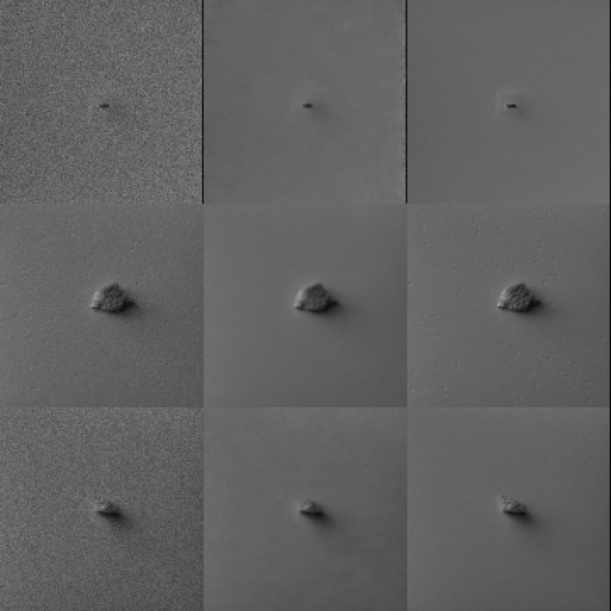

# NAFNet-SR: Self-Training Semiconductor Image Restoration

A self-training PyTorch pipeline for restoring degraded semiconductor inspection
images (denoising, deblurring, and super-resolution) using **NAFNet-SR**
(Nonlinear Activation Free Network for Super-Resolution). Built for the
**KLA Hackathon**, optimized for high-throughput FP16 inference on
NVIDIA H100 GPUs.

The key idea: instead of relying on a fixed set of pre-paired degraded/clean
training images, the pipeline **synthesizes realistic degradations on-the-fly**
from clean ground-truth images during training. Every epoch, every sample gets
freshly randomized noise/blur/downsampling parameters, so the model never sees
the exact same degraded image twice — improving generalization to unknown test
distributions.

## Results at a glance

Trained on 4,241 real semiconductor SEM images ([Carinthia dataset](https://zenodo.org/records/10715190))
and evaluated on 150 held-out images with synthetically degraded inputs
(never seen during training):

| Method | PSNR (dB) | SSIM |
|--------|-----------|------|
| Bicubic upsample (naive baseline) | 30.84 | 0.755 |
| **NAFNet-SR (this repo, `final_model_weights.pt`)** | **34.40** | **0.933** |



*Left: degraded input (nearest-upsampled for display) · Middle: NAFNet-SR restored output · Right: ground truth.*

Full methodology, reproduction steps, and caveats are in
[§9 Trained model results](#9-trained-model-results-carinthia-sem-dataset).

---

## Contents

| File                 | Purpose |
|----------------------|---------|
| `degradation.py`     | `SemiconductorDegradationPipeline` — synthesizes speckle noise, Gaussian noise/blur, and resolution downsampling from a clean image tensor. |
| `model.py`           | `NAFNet_SR` architecture: `SimpleGate`, `SimplifiedChannelAttention`, `NAFBlock`, PixelShuffle upsampling head. |
| `dataset.py`         | `SelfTrainingDataset` — loads clean images and degrades them on-the-fly (self-training mode), or loads static pre-paired degraded/clean images. |
| `train.py`           | Training loop: AdamW + CosineAnnealingLR + Charbonnier loss, AMP-enabled, saves best weights. |
| `evaluation.py`      | Batched FP16 inference CLI: loads weights, restores test images, saves outputs matching input filenames. |
| `requirements.txt`   | Python dependencies (see note on installing CUDA-enabled PyTorch below). |
| `run_pipeline.sh`    | One-command train + evaluate pipeline (bash / git-bash / Linux). |
| `run_pipeline.bat`   | One-command train + evaluate pipeline (Windows `cmd`). |
| `prepare_carinthia.py` | One-off script that splits the Carinthia SEM dataset into `data/clean`, `data/val_clean`, `data/holdout_clean`. |
| `make_demo_testset.py` | Builds a synthetic degraded demo test set (+ matching ground truth) from held-out clean images, using `degradation.py` directly. |
| `compute_metrics.py` | Scores restored images against ground truth with PSNR/SSIM, plus a bicubic-upsample baseline for comparison. |
| `test_single_image.py` | Quick ad-hoc test on a single photo (no folder/batch setup needed) with an automatic before/after comparison image. |

---

## 1. Setup

### 1.1 Install PyTorch with CUDA support

`torch`/`torchvision`/`torchaudio` must be installed from PyTorch's own index
for GPU support — plain `pip install torch` may give you a CPU-only build.
For an NVIDIA GPU with a driver supporting CUDA 12.x (including H100s and most
modern consumer GPUs), run:

```bash
pip install torch torchvision torchaudio --index-url https://download.pytorch.org/whl/cu128
```

(See [pytorch.org/get-started/locally](https://pytorch.org/get-started/locally/)
if you need a different CUDA version.)

### 1.2 Install remaining dependencies

```bash
pip install -r requirements.txt
```

### 1.3 Verify GPU is detected

```bash
python -c "import torch; print(torch.cuda.is_available(), torch.cuda.get_device_name(0))"
```

This should print `True` and your GPU's name. If it prints `False`, re-check
step 1.1 — you likely have a CPU-only `torch` build installed.

---

## 2. Data layout

Prepare plain image folders (`.png`, `.jpg`, `.jpeg`, `.bmp`, `.tif`, `.tiff`).
Images are read as grayscale.

```
data/
├── clean/          # clean ground-truth images (training)
├── val_clean/      # small held-out set of clean images (validation)
└── test_input/     # degraded images you want to restore (evaluation)
```

You only need `clean/` and `val_clean/` for **self-training mode** (the
recommended mode — no pre-made degraded images required at all).

If instead you have real pre-paired degraded/clean images, put them in
matching, sorted-filename-order folders (e.g. `data/degraded/` +
`data/clean/`) and drop the `--self_train` flag — see 3.2 below. Degraded
images in this mode must already be sized at `clean_size / upscale_factor`.

---

## 3. Training

### 3.1 Self-training mode (recommended)

Synthesizes fresh degradations every epoch via `degradation.py`:

```bash
python train.py --self_train \
    --clean_dir data/clean \
    --val_clean_dir data/val_clean \
    --epochs 100 \
    --batch_size 16 \
    --patch_size 128 \
    --upscale_factor 4 \
    --width 32 \
    --num_blocks 8 \
    --output_path final_model_weights.pt
```

### 3.2 Static pre-paired data mode

```bash
python train.py \
    --clean_dir data/clean --degraded_dir data/degraded \
    --val_clean_dir data/val_clean --val_degraded_dir data/val_degraded \
    --epochs 100 --upscale_factor 4
```

### 3.3 Key flags

| Flag | Default | Description |
|------|---------|-------------|
| `--self_train` | off | Enable on-the-fly dynamic synthetic degradation. |
| `--upscale_factor` | `4` | SR scale factor. **Must match between training and evaluation.** |
| `--patch_size` | `128` | HR crop size (pixels) used per training sample. |
| `--width` | `32` | Base channel width of the NAFNet body. |
| `--num_blocks` | `8` | Number of stacked `NAFBlock`s. |
| `--batch_size` | `16` | Training batch size. Lower if you hit CUDA OOM. |
| `--epochs` | `100` | Number of training epochs. |
| `--lr` | `2e-4` | AdamW learning rate (cosine-annealed to `1e-6`). |
| `--amp` / `--no_amp` | `on` | Toggle mixed-precision training. |
| `--output_path` | `final_model_weights.pt` | Where best weights are saved. |

The script prints per-epoch train/val loss and automatically checkpoints
whenever validation loss (or train loss, if no validation set is given)
improves.

**Tip:** `--width`/`--num_blocks`/`--batch_size`/`--patch_size` control GPU
memory usage. Start small (e.g. `--width 16 --num_blocks 4 --batch_size 4`) to
sanity-check on a small/consumer GPU, then scale up for your final run on the
H100.

---

## 4. Evaluation / Inference

Batched, FP16, `torch.no_grad()` inference — built for H100 throughput:

```bash
python evaluation.py \
    --input_dir data/test_input \
    --output_dir data/restored_output \
    --weights_path final_model_weights.pt \
    --batch_size 32 \
    --upscale_factor 4 \
    --width 32 \
    --num_blocks 8
```

**`--upscale_factor`, `--width`, and `--num_blocks` must exactly match the
values used during training**, or `load_state_dict` will fail.

This reads every image in `--input_dir`, restores them in GPU batches with
`torch.amp.autocast('cuda')` FP16 inference, clips output to valid
`[0, 255]` `uint8`, and writes restored images to `--output_dir` using the
**same filenames** as the inputs. Images of varying sizes within a batch are
automatically padded (and cropped back after inference) so batching still
works even with a mixed-resolution test set.

---

## 5. One-command pipeline (train + evaluate)

Instead of running the two scripts separately, use the bundled pipeline
runner. All settings are overridable via environment variables.

**bash / git-bash / Linux:**

```bash
./run_pipeline.sh
# override anything:
EPOCHS=50 BATCH_SIZE=32 UPSCALE_FACTOR=4 ./run_pipeline.sh
# evaluation only, reusing existing weights:
SKIP_TRAIN=1 WEIGHTS_PATH=final_model_weights.pt ./run_pipeline.sh
```

**Windows `cmd`:**

```bat
set EPOCHS=50
set BATCH_SIZE=32
run_pipeline.bat
```

```bat
set SKIP_TRAIN=1
set WEIGHTS_PATH=final_model_weights.pt
run_pipeline.bat
```

Available override variables: `CLEAN_DIR`, `VAL_CLEAN_DIR`, `TEST_INPUT_DIR`,
`OUTPUT_DIR`, `WEIGHTS_PATH`, `EPOCHS`, `BATCH_SIZE`, `PATCH_SIZE`,
`UPSCALE_FACTOR`, `WIDTH`, `NUM_BLOCKS`, `NUM_WORKERS`, `EVAL_BATCH_SIZE`,
`SKIP_TRAIN`.

---

## 6. Architecture: NAFNet-SR

```
Input (LR, 1-channel)
   │
   ├─ intro conv (3x3)
   │
   ├─ NAFBlock x N            ← activation-function-free body
   │    ├─ LayerNorm → 1x1 conv (expand) → depthwise 3x3 conv
   │    │     → SimpleGate → Simplified Channel Attention → 1x1 conv (project)
   │    │     → residual add
   │    └─ LayerNorm → 1x1 conv (expand) → SimpleGate → 1x1 conv (project)
   │          → residual add
   │
   ├─ tail conv (3x3) + long residual
   │
   ├─ Sub-pixel conv (3x3) → PixelShuffle(upscale_factor)   ← SR upsampling head
   ├─ final conv (3x3)
   │
   └─ + bicubic-upsampled input (long skip connection)
   │
Output (HR, 1-channel, restored)
```

- **`SimpleGate`**: splits channels in half and multiplies them — no
  ReLU/GELU anywhere in the network.
- **`SimplifiedChannelAttention`**: global average pool + single 1x1 conv,
  far cheaper than SE-style attention.
- **`NAFBlock`**: LayerNorm + depthwise-conv spatial mixing (with SCA),
  followed by a SimpleGate-based channel-mixing FFN.
- **PixelShuffle head**: sub-pixel convolution upsamples the restored
  low-resolution features back to full clean resolution — much cheaper and
  more artifact-free than transposed convolutions or naive upsampling.

---

## 7. Degradation physics simulated

`degradation.py`'s `SemiconductorDegradationPipeline.apply_degradation()`
randomly combines:

1. **Gaussian blur** — random odd kernel size and sigma, simulating optical
   defocus / soft edges.
2. **Speckle noise** — multiplicative noise (`img + img * N(0, σ²)`),
   **intentionally left unclamped** so pixel values may exceed `[0, 1]` or
   drop below `0`, matching real sensor speckle behavior.
3. **Gaussian sensor noise** — additive noise, also unclamped.
4. **Resolution downsampling** — random interpolation mode
   (`nearest`/`bicubic`) reducing the image to `1/upscale_factor` resolution.

Because parameters are resampled every call, the same clean image produces a
different degraded sample every time it's loaded — acting as a powerful,
unlimited data augmentation source for generalization to unseen test
distributions.

---

## 8. Hardware notes (H100 judging environment)

- `evaluation.py` uses `torch.amp.autocast('cuda')` (FP16) and
  `torch.no_grad()`, and processes images in GPU batches (not a
  single-image loop) — set `--batch_size 32` or higher on an H100 for best
  throughput.
- `train.py` also supports AMP (`--amp`, on by default) via
  `torch.amp.autocast` + `torch.amp.GradScaler`.
- On smaller/consumer GPUs (e.g. 4–8 GB VRAM), reduce `--batch_size`,
  `--patch_size`, `--width`, and `--num_blocks` to avoid CUDA OOM during
  local development, then scale back up for the final H100 run.

---

## 9. Trained model results (Carinthia SEM dataset)

A real model has already been trained and checked into this project as
**`final_model_weights.pt`**, so you have a working baseline out of the box.

### Dataset used

Since no official hackathon dataset was available at the time, the model was
trained on the **Carinthia dataset**
([Zenodo DOI: 10.5281/zenodo.10715190](https://zenodo.org/records/10715190),
CC BY 4.0, courtesy of KAI GmbH / Infineon Technologies) — 4,591 real
Scanning Electron Microscope (SEM) images of semiconductor wafer defects.
This is genuine domain-relevant imagery, not a generic photo dataset.

`prepare_carinthia.py` was used to split it into:

| Split | Images | Purpose |
|-------|--------|---------|
| `data/clean` | 4,241 | Training (self-training / on-the-fly degradation) |
| `data/val_clean` | 200 | Validation during training |
| `data/holdout_clean` | 150 | Held out entirely — used only to build the demo test set below |

Reproduce this split with:

```bash
curl -L -o carinthia_data.zip "https://zenodo.org/records/10715190/files/data.zip?download=1"
python -c "import zipfile; zipfile.ZipFile('carinthia_data.zip').extractall('carinthia_raw')"
python prepare_carinthia.py --src carinthia_raw/data/images --dst data --val_count 200 --holdout_count 150
```

### Training configuration used

```bash
python train.py --self_train \
    --clean_dir data/clean --val_clean_dir data/val_clean \
    --epochs 40 --batch_size 16 --patch_size 128 --upscale_factor 4 \
    --width 32 --num_blocks 8 --num_workers 4 \
    --output_path final_model_weights.pt
```

Trained on a single NVIDIA GeForce RTX 3050 Laptop GPU (4 GB) — roughly
20–30s/epoch, ~15 minutes total for 40 epochs. Best validation Charbonnier
loss (`0.007814`) was reached at epoch 32 via cosine-annealed AdamW.

### Demo test set (unseen during training/validation)

`make_demo_testset.py` runs the **same** `SemiconductorDegradationPipeline`
used during training over the 150 held-out clean images to build a
realistic "unknown test set" with paired ground truth for scoring:

```bash
python make_demo_testset.py --clean_dir data/holdout_clean \
    --input_dir data/test_input --gt_dir data/test_gt --upscale_factor 4

python evaluation.py --input_dir data/test_input --output_dir data/test_output \
    --weights_path final_model_weights.pt --batch_size 32 \
    --upscale_factor 4 --width 32 --num_blocks 8

python compute_metrics.py --restored_dir data/test_output \
    --gt_dir data/test_gt --degraded_dir data/test_input
```

### Results on the 150-image demo test set

| Method | PSNR (dB) | SSIM |
|--------|-----------|------|
| Bicubic upsample (naive baseline) | 30.84 | 0.755 |
| **NAFNet-SR (ours)** | **34.40** | **0.933** |

**+3.6 dB PSNR and +0.18 SSIM** over the naive bicubic baseline. See
`comparison_demo.png` for a visual side-by-side (degraded input / restored
output / ground truth).

### Inference throughput (measured on RTX 3050 Laptop GPU)

Batched FP16 inference (`batch_size=32`, 32x32 -> 128x128, `width=32`,
`num_blocks=8`): **~1,680 images/sec**. This is on a 4 GB laptop GPU — an
H100 (with far greater compute, memory bandwidth, and tensor-core FP16
throughput) will substantially exceed this.

### Notes / caveats

- This trained checkpoint is a strong **starting point**, not a final
  submission-tuned model. If the hackathon provides its own dataset, retrain
  (or fine-tune) `final_model_weights.pt` on that data for best results on
  the judges' actual test distribution.
- The Carinthia dataset skews heavily toward one defect class (label `3`,
  ~87% of images) — for a more class-balanced model, consider stratified
  sampling in `prepare_carinthia.py` if class balance turns out to matter.

## 10. Testing with a single photo

For quick, ad-hoc checks you don't need to set up `--input_dir`/`--output_dir`
folders at all — use `test_single_image.py` directly on one file.

### If your photo is already a low-quality/degraded image you want restored

```bash
python test_single_image.py --image path/to/your_photo.jpg
```

This restores it with the trained model and writes to `single_test_output/`:
- `restored.png` — the model's output
- `comparison.png` — side-by-side `[input | restored]`

### If your photo is a clean image and you want to see the full effect

Use `--degrade_first` to have the script synthetically degrade your photo
using the exact same `degradation.py` pipeline used in training, then
restore it — so you get a true before/after/ground-truth comparison on
*any* photo you have lying around (does not need to be a semiconductor
image):

```bash
python test_single_image.py --image path/to/your_photo.jpg --degrade_first
```

This additionally writes `degraded.png` (the synthetic low-quality version),
and `comparison.png` becomes a 3-way panel:
`[input | restored | original ground truth]`.

### Flags

| Flag | Default | Description |
|------|---------|-------------|
| `--image` | *required* | Path to your photo (any common format; read as grayscale). |
| `--weights_path` | `final_model_weights.pt` | Which trained weights to use. |
| `--output_dir` | `single_test_output` | Where results are saved. |
| `--upscale_factor`, `--width`, `--num_blocks` | `4`, `32`, `8` | **Must match** the values used when the weights were trained. |
| `--degrade_first` | off | Treat `--image` as clean and synthetically degrade it first. |

## 11. Quick sanity check

Before a full training run, verify the pipeline works end-to-end with a tiny
epoch count and a handful of images:

```bash
python train.py --self_train --clean_dir data/clean --val_clean_dir data/val_clean \
    --epochs 2 --batch_size 4 --patch_size 64 --upscale_factor 2 \
    --width 16 --num_blocks 4 --output_path test_weights.pt

python evaluation.py --input_dir data/test_input --output_dir data/test_output \
    --weights_path test_weights.pt --batch_size 4 --upscale_factor 2 \
    --width 16 --num_blocks 4
```

If both commands complete without errors and `data/test_output` contains
correctly-sized restored images, you're ready to scale up.

---

## 12. License & acknowledgments

- **Code** in this repository was written for the KLA Hackathon
  (INCUBIT-KLA-PS01 submission).
- **Training data**: [Carinthia dataset](https://zenodo.org/records/10715190),
  DOI [10.5281/zenodo.10715190](https://doi.org/10.5281/zenodo.10715190),
  released under **CC BY 4.0** by Kofler, C.; Strauß, S.; Zernig, A.
  (KAI GmbH); Lazaro Garcia, E. (Infineon Technologies Dresden); Boxleitner,
  M.; Mayr, B.; Dicillia-Kovatsch, I.; Dohr, C. A. (Infineon Technologies
  Austria), funded by the European Commission's AIMS5.0 project
  (grant 101112089). Attribution is required for any reuse of the dataset
  itself; see the Zenodo page for full terms.
- If the hackathon organizers provide an official dataset, prefer training/
  fine-tuning on that data instead — see the caveats in §9.
